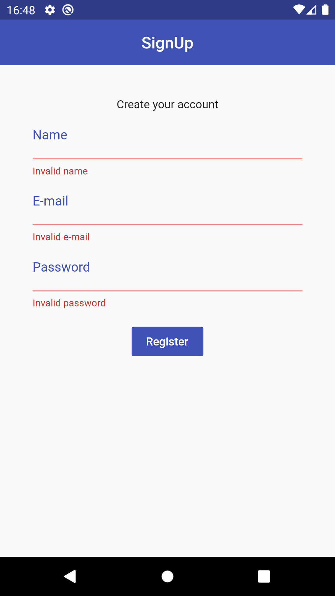

# mobx-with-architecture

This is a simple Flutter signup example that demonstrates an architecture pattern for mobile apps.

*Dependencies: MobX (including dev dependencies **mobx_codegen** and **build_runner**) and Provider.*

## Arhitecture components

* View (pages);
* ViewModel;
* Controller;
* Repository;
* Model;
* Store (for a global state management)

## TODOs

* Improve form field validations;
* Include a password confirmation (and validation);
* Integration with some REST API;
* Refactoring to implement dependency inversion on the repository.

## ScreenShots

   